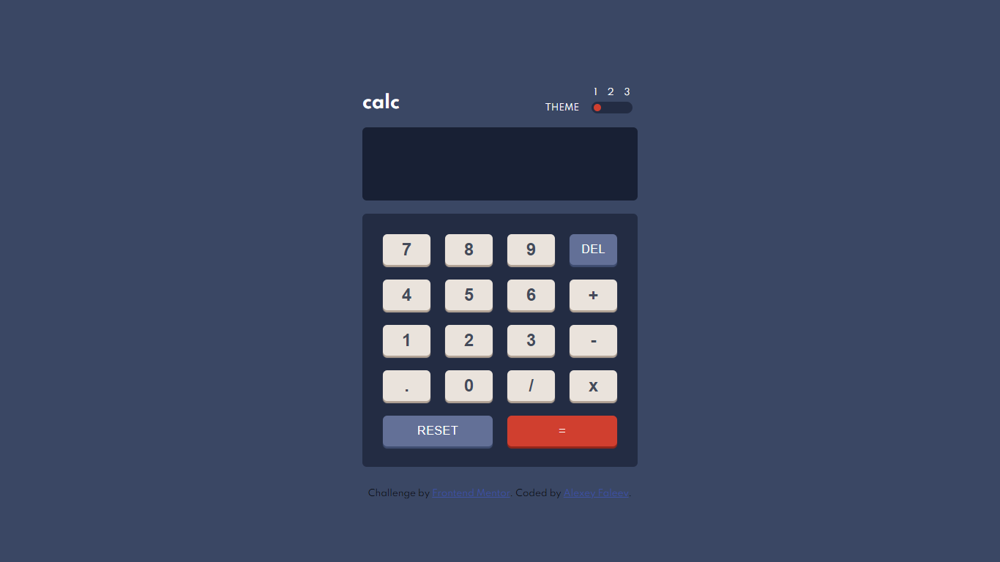

# Frontend Mentor - Calculator app solution

This is a solution to the [Calculator app challenge on Frontend Mentor](https://www.frontendmentor.io/challenges/calculator-app-9lteq5N29). Frontend Mentor challenges help you improve your coding skills by building realistic projects.

## Table of contents

- [Overview](#overview)
  - [The challenge](#the-challenge)
  - [Screenshot](#screenshot)
  - [Links](#links)
- [My process](#my-process)
  - [Built with](#built-with)
  - [What I learned](#what-i-learned)
  - [Continued development](#continued-development)
  - [Useful resources](#useful-resources)
- [Author](#author)

## Overview

### The challenge

Users should be able to:

- See the size of the elements adjust based on their device's screen size
- Perform mathmatical operations like addition, subtraction, multiplication, and division
- Adjust the color theme based on their preference
- **Bonus**: Have their initial theme preference checked using `prefers-color-scheme` and have any additional changes saved in the browser

### Screenshot

### Links

- Solution URL: 
- Live Site URL: 

## My process

### Built with

- HTML5
- CSS custom properties
- Flexbox
- CSS Grid
- Vanilla JS

### What I learned

Working with this project, I improved my understanding of CSS Grid, Flexbox, working with DOM.

### Continued development

Deepen your knowledge of CSS, as well as immerse yourself in the study of React, and write the following projects on it.

### Useful resources

- [Tint & Shade Generator](https://maketintsandshades.com/) - Helps to select more suitable colors.

## Author

- Github - [Alexey Faleev](https://github.com/BeemoCode)
- Frontend Mentor - [@BeemoCode](https://www.frontendmentor.io/profile/BeemoCode)
